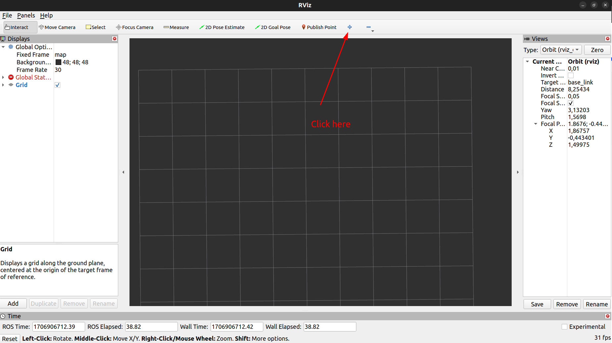
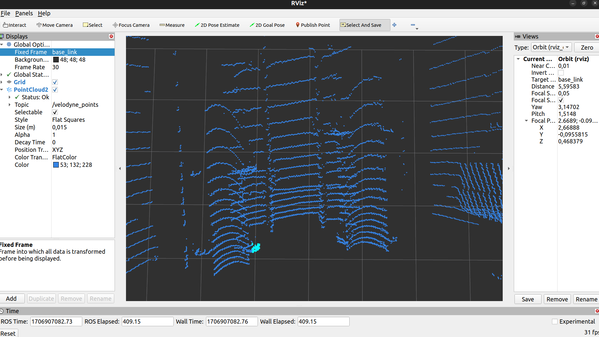
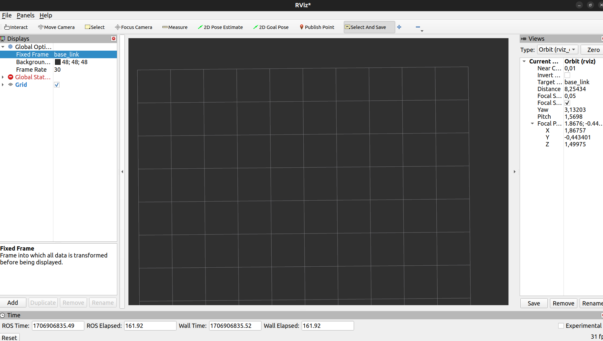

# select_and_save_plugin
A RViz2 plugin to save selected point cloud statistics. Project based on https://github.com/drwnz/selected_points_publisher/.

# Requirements
```bash
sudo apt install ros-dev-tools
sudo rosdep init
rosdep update
```

# Build

```
mkdir -p rviz2_plugin_ws/src
git clone https://github.com/delipl/select_and_save_plugin rviz2_plugin_ws/src -b humble
cd select_and_save_plugin
rosdep install --from-paths src --ignore-src --rosdistro humble -y
colcon build
```

# Running

```
source install/setup.bash
rviz2
```

Add the `SelectAndSave` tool from tools bar:



Select the `SelectAndSave` tool from tools bar:


Select a region of interest from pointcloud published on `/velodyne_points` topic:


Press `p` to save data to the yaml file  `rviz_selected_supports.yaml` and then press `n` to go to call `PlayNext` from `ros2bag_player`.